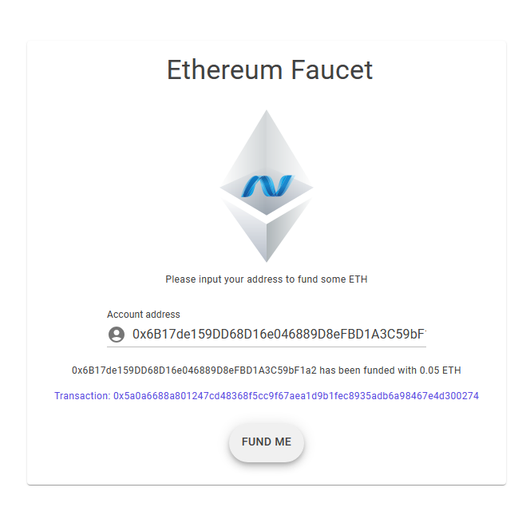

# Nethereum.Faucet

Faucet template to fund EVM based chain accounts, including web front end and rest api



## Installation as a dotnet new template
To install the faucet as a "dotnet new" template use the following command:

```
dotnet new -i Nethereum.Templates.Faucet::*
```

Then run:

```
dotnet new nethereumfaucet -n YourChainFaucet
```

Where -n YourChainFaucet is the Name and Namespace of your project.

## Manual clone, installation
Clone the repo,
install the template by running
```
dotnet new install .\
```

and you will get:

```
Template Name                         Short Name        Language  Tags
------------------------------------  ----------------  --------  ----------------
Nethereum Faucet Blazor and Rest Api  nethereum-faucet  [C#]      Nethereum/Faucet

```

## Configuration settings:
### Appsettings.json

Please modify the appsettings file to provide the Ethereum address, Explorer for transactions, private key and the maximum amount to fund.
```
"RpcAddress": "http://localhost:8545",
"FunderPrivateKey": "0xb5b1870957d373ef0eeffecc6e4812c0fd08f554b37b233526acc331bf1544f7",
"MaxAmountToFund": "0.05",
"AmountToFund": "0.05",
"CurrencySymbol": "ETH",
"ChainName": "Ethereum",
"UrlTxnExplorer": "http://BLOCKEXPLORER-ADDRESS/"
```
